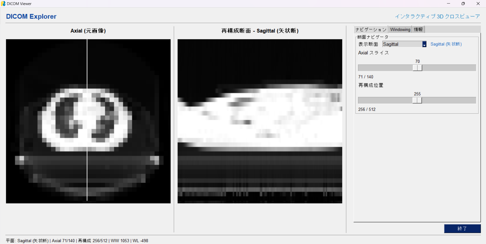
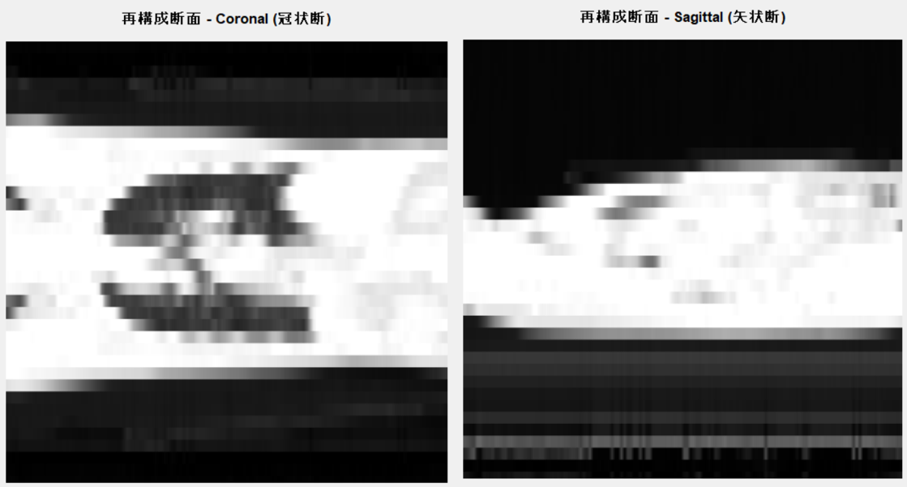
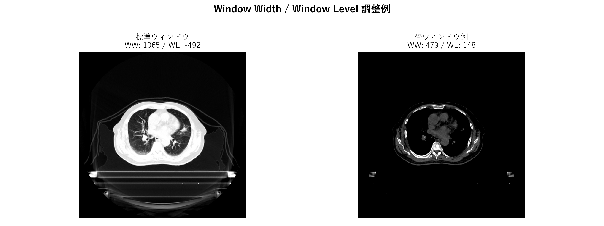

# DICOM ビューア操作マニュアル

このマニュアルは、医用画像の予備知識がない方でも本アプリを導入・操作できるように作成しています。以下の手順に従って環境構築から操作まで進めてください。

---

## 1. 動作環境

- **対応 OS**: Windows 10/11（macOS、Linux でも Python が動作すれば利用可能）
- **Python**: 3.10 以上を推奨
- **必要なライブラリ**: `pydicom`, `numpy`, `pillow`, `PySimpleGUI`, `matplotlib`
- **GPU や特別なハードウェアは不要**。一般的なノート PC で動作します。

`pip install -r requirements.txt` を実行すると、PySimpleGUI の私設リポジトリから正しいビルドが自動で取得されます。

---

## 2. 初回セットアップ

1. **Python を準備**
   - Python が未インストールの場合は [https://www.python.org/](https://www.python.org/) から最新版を入手し、インストールします。
   - インストール時は「Add Python to PATH」にチェックを入れてください。

2. **プロジェクトを取得**
   - プロジェクト一式（このフォルダ）を任意の場所に配置します。
   - 以下の説明では例として `C:\Projects\viewer` を利用します。ご自身の環境に合わせて読み替えてください。

3. **PowerShell を起動し、プロジェクトに移動**

   ```powershell
   cd C:\Projects\viewer
   ```

4. **（任意ですが推奨）仮想環境を作成・有効化**

   ```powershell
   python -m venv .venv
   .\.venv\Scripts\Activate.ps1
   ```

5. **依存パッケージをインストール**

   ```powershell
   pip install -r requirements.txt
   ```


## 3. アプリの起動

以下のコマンドで GUI を起動します。

```powershell
python app.py
```

数秒で PySimpleGUI ベースのウィンドウが表示され、左に原画像（Axial）、右に再構成画像（Sagittal または Coronal）が並びます。

---

## 4. 画面の見方



1. **Axial（左側）**: 元の断層画像を表示します。縦横は DICOM の Rows/Columns に対応します。
2. **再構成断面（右側）**: Sagittal（矢状断）または Coronal（冠状断）を表示します。
3. **オーバーレイ線**: Axial 上に、右側の断面位置を示す線が表示されます。
   - Sagittal 選択時: 縦線
   - Coronal 選択時: 横線
4. **コントロールパネル**: 右側の縦長領域に「断面ナビゲータ」「Windowing」「シリーズ情報」が並び、パラメータをまとめて変更できます。
5. **ステータスバー**: 画面下部に現在の平面、スライス番号、WW/WL などが表示され、調整結果を即座に把握できます。
6. **リサイズ対応**: 初回起動時に自動で全画面化されます。ウィンドウをリサイズしてもコントロールパネルは広さを保ち、視認性が損なわれません。

---

## 5. 操作方法（スライダ・ボタンの効果）

### 5.1 再構成面の選択



- **「断面ナビゲータ」フレーム**の **表示断面** コンボボックスで `Sagittal`（矢状断）または `Coronal`（冠状断）を選びます。
- 選択に応じて右側の画像が切り替わり、Axial 上のガイド線も縦線／横線に変わります。
- 面を切り替えると再構成スライダの範囲が自動で調整され、表示タイトルも「再構成断面 - Sagittal（矢状断）」のように更新されます。
- 元の状態に戻したい場合は、Windowing セクション下部の `Reset Plane` ボタンを押すと `Sagittal` / 既定スライスへ戻ります。

### 5.2 Axial スライス

- **「断面ナビゲータ」フレーム**の `Axial スライス` スライダで元画像のスライス番号を変更します。
- スライダ下部に現在位置と全スライス数が表示されます（例: `120 / 300`）。
- **目的とする臓器や構造を中央に表示したい場合**: Axial スライダをゆっくり動かして該当スライスを探します。

### 5.3 再構成位置

- **同じフレーム**の `再構成位置` スライダは、現在の断面（Sagittal または Coronal）の位置を指定します。
- 右側の再構成画像と、左側 Axial 上のガイド線が同時に更新されるため、断面位置の把握が容易です。
- **左右方向の位置関係を確認したい場合**は Sagittal、**前後方向を確認したい場合**は Coronal を選び、スライダを調整します。

### 5.4 Window Width (WW) / Window Level (WL)



- **「Windowing」フレーム**で、画像のコントラストと明るさを調整します。
- **WW（幅）**: コントラスト幅を制御します。値を小さくすると狭い濃度範囲が強調され、骨などが見えやすくなります。大きくすると全体が均一になります。
- **WL（レベル）**: 中心輝度を制御します。値を上げると画像が明るく、下げると暗くなります。
- スライダ右側に現在値が表示されます。極端な値に設定した際は `WW/WL 初期化` ボタンで初期状態に戻せます。
- プリセットボタン（Soft Tissue / Bone / Lung / Head）は代表的な WW/WL の組み合わせを即座に適用します。適用後はステータスバーと「プリセット」欄に選択内容が表示されます。
- `全画面` ボタンを押すと、手動でウィンドウをリサイズした後でも再度最大化できます。

---

## 6. 表示したい画像を得るためのコツ

| 目的 | 推奨操作 |
| --- | --- |
| 骨構造を鮮明にしたい | `Bone` プリセットを適用し、必要に応じて WL を微調整 |
| 軟部組織のコントラストを上げたい | `Soft Tissue` プリセットを基準に WW/WL を微調整 |
| 臓器の左右位置を把握したい | Plane を `Sagittal` にし、再構成位置スライダで左右を走査 |
| 前後方向の広がりを確認したい | Plane を `Coronal` にし、Axial と再構成位置スライダを併用 |

- スライダを大きく動かした後は、細かい調整を行うと理想的な表示が得られます。
- 調整中に画像が真っ黒・真っ白になった場合は WW/WL を初期化してください。
- ステータスバーに表示される現在値（例: `平面: Sagittal (矢状断) | Axial 70/140 | 再構成 256/512 | WW 400 | WL 50`）も参考にすると、チーム内で値を共有しやすくなります。

---

## 7. トラブルシューティング

- **「Failed to load DICOM series」と表示される**
  - `img/` フォルダ内に DICOM (`.dcm`) ファイルが存在するか確認してください。
  - 異なるシリーズが混在している場合は、同一シリーズのみを同じフォルダに配置してください。

- **画像が読み込めるがコントラストが極端**
  - WW/WL を初期化し、再度調整してください。
  - DICOM に正しいスケールが記録されていないケースでは、手動で調整が必要です。

- **右側のパネルが見切れる**
  - ウィンドウが極端に小さい場合に発生します。ウィンドウを広げるか `全画面` ボタンを押すと、コントロールパネルが自動で再配置され全て表示されます。

- **操作が重い**
  - 数百スライス以上ある場合でも CPU で処理可能ですが、同時に他アプリを起動していると遅くなることがあります。不要なアプリを閉じてからご利用ください。

---

## 8. アプリを終了するには

- ウィンドウ右上の「×」ボタン、または画面下部の「終了」ボタンを押してください。
- 仮想環境を使用している場合は、PowerShell に戻り次のコマンドで無効化できます。

  ```powershell
  deactivate
  ```

---

## 9. 参考情報

- 表示されているメタデータは DICOM ファイルに記録された情報です。記載がない項目は空欄となります。
- 画像サイズやスライス厚は撮影プロトコルによって異なります。本アプリは読み込んだデータをそのまま再構成するため、撮影条件に依存します。

以上で操作は完了です。ご不明点があれば、アプリのウィンドウを確認しながら本マニュアルに沿って手順を再確認してください。